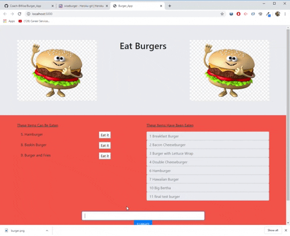

# sql_burgers

## Overview

This basic CRUD App was created to show competence in Express Handlebars and MySQL.
Visit the deployed version [here](https://wiseburger.herokuapp.com/).

## Objective

The App allows the user to type in an item and click submit. This will render the item to the page. Once rendered, you user can click a button to "Eat it" this will show to the Eaten side.

## Created with

- [Node](https://nodejs.org/en/)
- [Express](https://www.npmjs.com/package/express)
- [Express-Handlebars](https://www.npmjs.com/package/express-handlebars)
- [MySql](https://www.mysql.com/)

## Author

**Bryan Wise**
